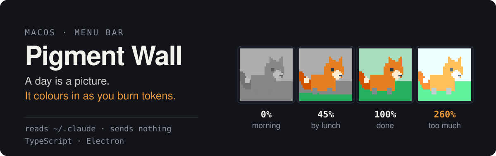
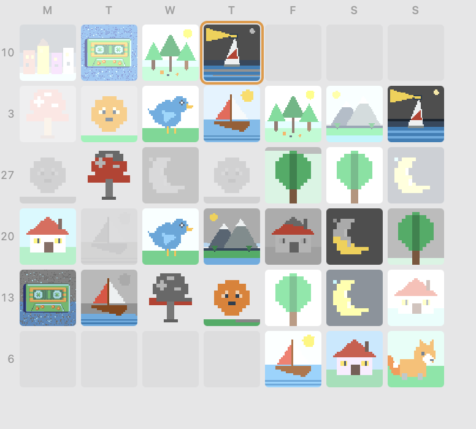
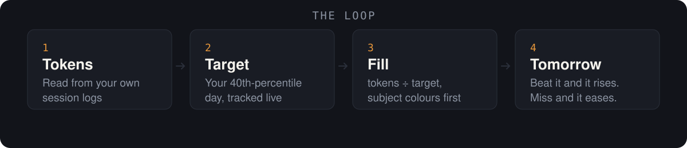
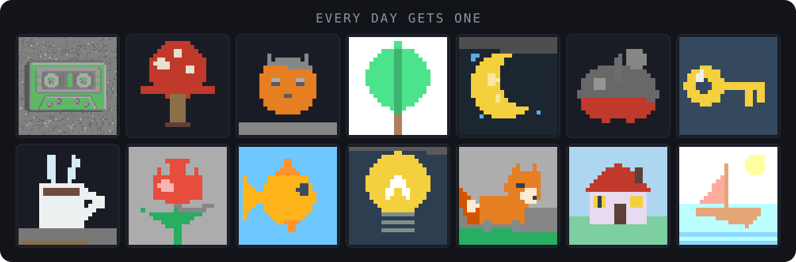

<p align="center">
  
</p>

Every day you get one grayscale pixel-art picture. It colours in as you burn AI
tokens, read from your own Claude Code session logs. Yesterday's picture stays
on the wall, frozen at however filled it got, and so does every day before it.

The difficulty adapts: finish too easily and tomorrow's bar is higher. The
picture isn't a score, and there are no streaks to protect — it's a record of
the shape of your month.

---

## The wall

<p align="center">
  
</p>

Seven columns, Monday first, newest week on top. Today is outlined. Because
position encodes the date, a weekly rhythm you'd never notice in a list becomes
obvious — a column of bright weekends beside a column of pale Tuesdays, and a
run of grey cells where you took a week off.

Click the menu-bar icon to open it. The icon is today's picture reduced to its
silhouette, colour rising through it bottom-up as the day goes on — so you can
read your progress without opening anything. It carries a contrasting halo that
flips with the menu bar's appearance, and past 100% it blooms.

## How the bar moves

<p align="center">
  
</p>

Two numbers do all of it, and they do different jobs.

**`q` is the completion rate.** The target settles at your qth-percentile day, so
you finish `1 − q` of them. It calibrates against *your* history, not a number
someone else picked.

| `q` | Bar sits at | Days that complete |
| --- | --- | --- |
| 0.30 | your 30th-percentile day | ~72% |
| **0.40** | **your 40th-percentile day** | **~62%** |
| 0.50 | your median day | ~52% |

**`k` is how fast it reacts.** At `0.15`, smashing the target raises tomorrow's
bar about 6% and missing it lowers the bar about 9% — a slow tide, not a
thermostat that flinches every time you have a bad afternoon.

Past 100% the picture keeps going: colours push past natural into bloom, and a
day at 3× the target is visibly blown out. Overshoot is rendered as damage
rather than a trophy, on purpose.

Full reasoning, and what was rejected, is in [`docs/SPEC.md`](docs/SPEC.md) —
fourteen settled decisions, each with the measurement behind it.

## The pictures

<p align="center">
  
</p>

Colour spreads in an order the drawing carries with it: **subject first,
background last**, and bottom-up within each colour. At 40% you get a fully
coloured fox on a grey field, which reads as a finished illustration. The other
way round reads as broken.

Thirteen drawings so far, across three complexity tiers — a harder day gets a
busier picture, so the raised bar is visible rather than hidden in a number.
They're placeholders, and replacing one is a single file.

Bring your own — one image, a folder of sprites, or a sprite sheet:

```sh
npm run import -- my-art.png --tier=3 --id=cassette
npm run import -- ./pack/Tiles/ --tier=2 --prefix=dungeon
npm run import -- ./pack/sheet.png --sheet=8x5 --tier=2 --prefix=dungeon
```

The importer finds the artist's grid rather than downsampling — a 64×64 drawing
exported at 1216×1216 is recovered as the 64×64 it actually is — then extracts
the palette and guesses the fill order for you to correct.

Sheet mode slices a grid into one drawing per cell and skips empty ones; folder
mode takes every PNG in a directory. Both trim each sprite to its bounds and pad
it back to a square.

That makes CC0 asset packs usable directly — but **only the pixel-art ones**.
[Kenney](https://kenney.nl) ships both kinds, and the smooth cartoon packs
(Monster Builder and friends) are anti-aliased vector art that turns to mush at
tile size. The importer refuses them and says why. Good starting points:
[Tiny Dungeon](https://kenney.nl/assets/tiny-dungeon) (130+ sprites, colour,
CC0), or [OpenGameArt](https://opengameart.org) and
[itch.io](https://itch.io/game-assets/assets-cc0/tag-pixel-art) filtered to CC0.
Kenney's [1-Bit Pack](https://kenney.nl/assets/1-bit-pack) is tempting and wrong
— it is monochrome, and this is an app about colour arriving.

Sprites suit this better than the scenes shipped here, incidentally: they arrive
on transparency, which is already how the art layer says *outside the picture*.
That gives the tray icon a clean silhouette for free and removes the one fiddly
authoring decision — which colours count as scenery.

## Run it

Requires macOS and Node 24+, and assumes you use Claude Code.

```sh
npm install
npm start                 # build and run
npm run package           # -> out/"Pigment Wall.app"
```

Launch the packaged app once and approve the notification prompt. macOS grants
notification rights to bundles, not to a bare `electron .`, so roasts only
arrive from a packaged build.

## What it reads

Only two fields, from `~/.claude/projects`: the **timestamp** and the **token
counts** of each assistant response.

It never reads the content of your conversations, file paths, project names or
branch names — they are in those files, and the parser is built not to take
them. A test asserts they cannot cross that boundary. Nothing is sent anywhere;
there is no network code in the app.

Your wall lives in `~/Library/Application Support/pigment-wall/`.

## Settings

The tray menu's **Settings…** opens a commented `config.jsonc`, written on first
run. Every knob carries the reasoning for its default, because `"q": 0.4` means
nothing without the sentence explaining that q *is* the completion rate. Edits
apply within seconds — no restart.

Worth knowing: the day boundary is **04:00, not midnight**, so a session that
runs past midnight stays one picture. Change it if your hours differ.

## Roasts

Six conditions — an all-time record, an unusually fast hour, a comeback after
days away, a late session, a dead day, an overshoot. Each has four lines and a
thirty-day repeat filter.

Only the first four can raise a notification, capped at **one per day**. A dead
day and an overshoot get a line in the popover but never interrupt: the app
doesn't scold you for resting, and something that happens on 30% of days isn't a
surprise. Replayed over a real month that comes to about **1.4 notifications a
week**. The toggle is the first item in the tray menu.

## Development

```sh
npm test          # 111 tests, no test dependencies
npm run typecheck
npm run replay    # your real history through the controller, as ASCII
npm run sweep     # grid over q and k, checked against your own data
node src/tools/preview.ts --ascii    # the pictures at each fill level
```

The engine was built headless first and is still where every decision lives:
`q` and `k` can't be tuned by *using* the app — that's three weeks per
experiment — so they're tuned by replaying sixty days in half a second.

Distribution is `npm run package` (ad-hoc signed, enough to run locally) and
`npm run notarize` when a Developer ID certificate is present. No packaging
dependency: it copies Electron.app, drops the bundle in, rewrites six
Info.plist keys.

## Status

M1–M3 are done, and M4 all but. Remaining: the full image set, and Developer ID
signing for handing it to someone else. A native Swift/AppKit
rewrite is parked, not rejected — see [`docs/SPEC.md`](docs/SPEC.md) §13 for the
measurements and why the cost is the opposite of what you'd guess.

macOS only. ISC licensed.
